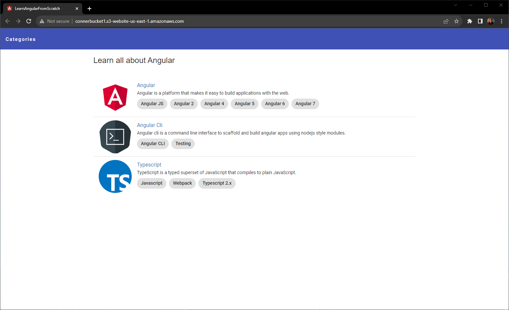
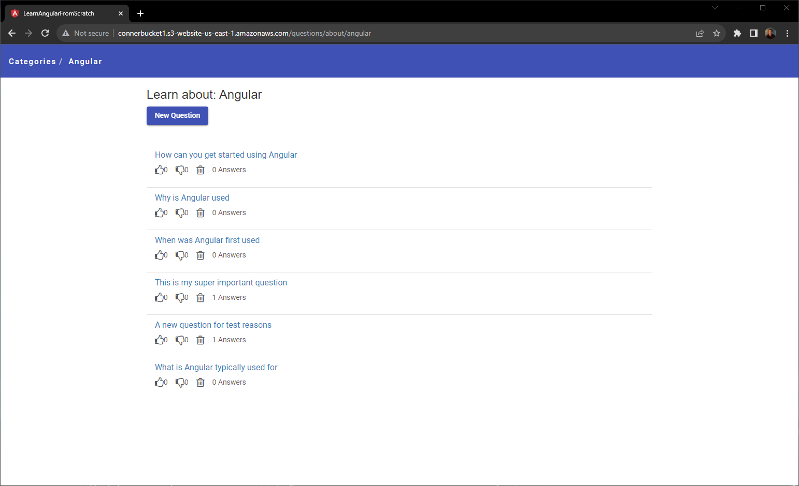
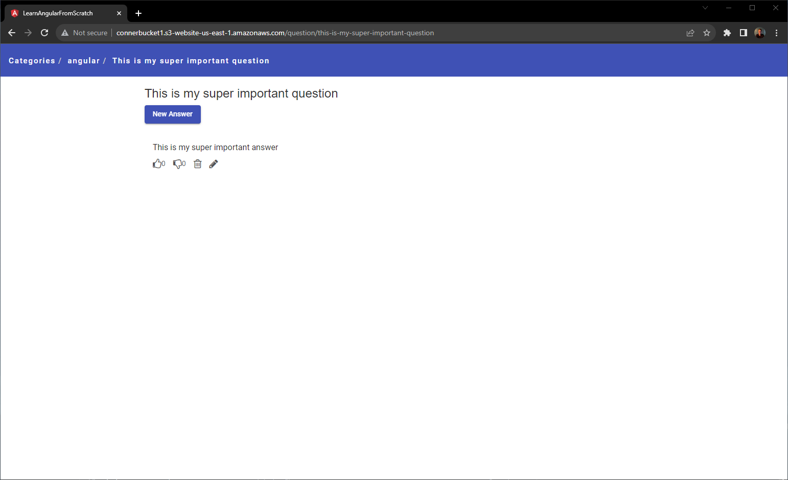

# UPDATE:
I've deployed this project using AWS. Some of the things I've experimented with / used in this project are:

- Containerization with Docker
- AWS Lambdas
- EC2
- S3
- Angular
- Writing APIs

The deployed project can be found [here](http://connerbucket1.s3-website-us-east-1.amazonaws.com/)

Below is a screenshot of the landing page:

There, you can click on the "Angular" section to be taken to the question page:

The questions are filled using json data, which is pulled from DynamoDB. Each question has a unique key that is matched with an answer's unique key in DynamoDB to provide the answers to the questions. You can click on a question to see the question's answers:

# What will I find in this project:

This project is forked from a repository for learning Angular, so you will find a "question-answer" system focused on Angular. There are only example questions populating the sections

With AWS, I created methods for performing CRUD operations on the lists of questions and answers. So now, a user can input a question into the question list and an answer into the answer list.

---

# Angular Tutorial: Learn Angular from scratch step by step REST API

This project is a Loopback API used in part 2 of [Learn Angular from scratch step by step tutorial](https://angular-templates.io/tutorials/about/learn-angular-from-scratch-step-by-step) where we explore from the basic concepts and why’s of Angular to building a complete Angular 7 app with the MEAN stack.

The goal of this angular 7 tutorial is to guide you through the coding of a full-stack JavaScript example application project and connecting a backend API to an Angular front-end application employing the MEAN stack.

By the end of this Angular advanced tutorial, you will learn about the mean stack from scratch, including how to build a RESTful API with Loopback and using it to perform CRUD operations on a MongoDB database through an Angular frontend.

Get the step by step free tutorial in https://angular-templates.io/tutorials/about/learn-how-to-build-a-mean-stack-application

**Please support this project by simply putting a Github star ⭐. Thanks 🙏**

## Installation

Run `npm install` to install all the required dependencies

Then run `npm run start` to start the API in your local environment.

Web server listening at: http://localhost:3000

Browse your REST API at http://localhost:3000/explorer

*Please [read the tutorial](https://angular-templates.io/tutorials/about/learn-how-to-build-a-mean-stack-application) to see how to use this project*

After installing the node dependencies run the following command to generate the sdk:
`./node_modules/.bin/lb-sdk server/server.js ./client/sdk`
